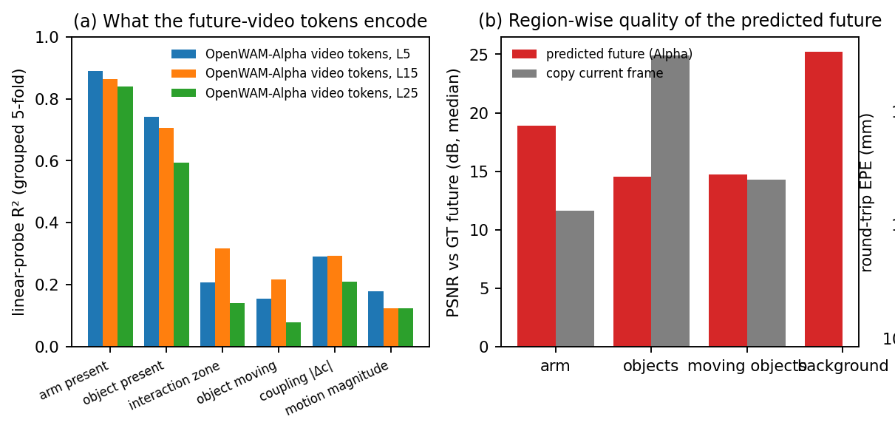
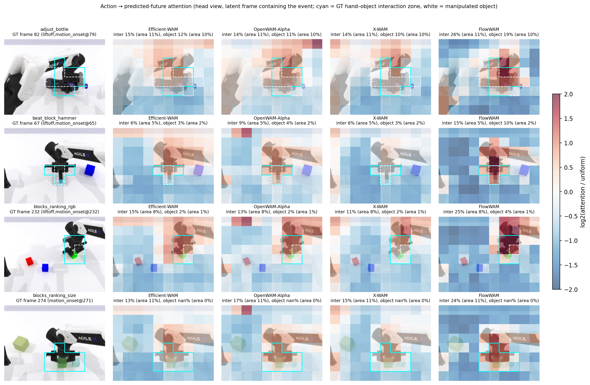
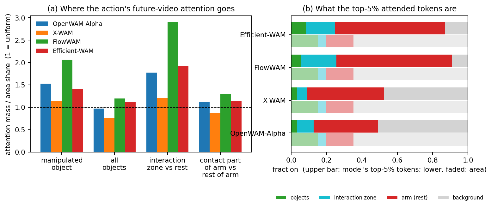
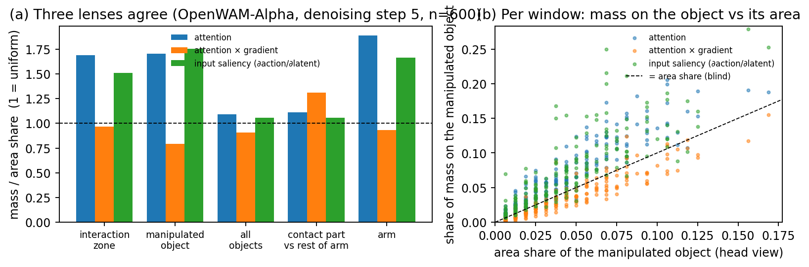
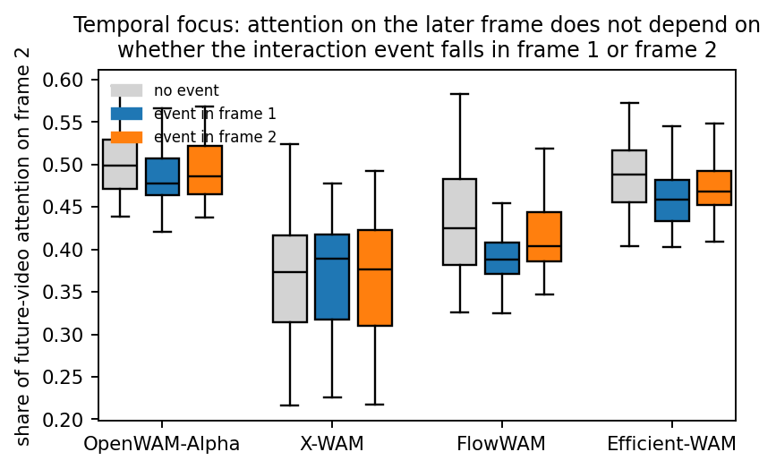
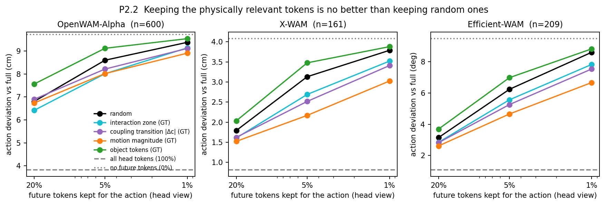
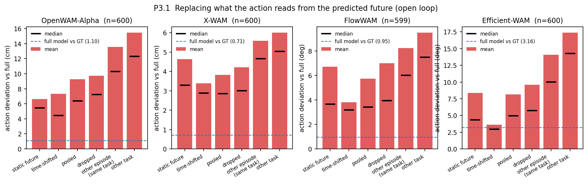

# MetisWAM4D 机理探查实验：现象、结论与证据（最终记录）

> 2026-09-22 至 09-24。对公开 WAM baseline 做**纯推理探查**（不改权重、不训练），把三个贡献点各自针对的"现有方法的缺陷"坐实，为论文 Experiments 的 motivation / analysis 提供图表。
> 本文合并了 09-22 进展记录与 09-23 两份周会材料，是唯一维护的版本。图在 `docs/assets/probe_260923/`，原始数字与逐窗口文件在 `/ytech_milm_intern/danglingwei/outputs/MetisWAM4D_260921/probes/`，代码在 `scripts/probe/`。
> 每条结论标注证据强度：**强** = 多模型、全量窗口、多镜头一致；**中** = 成立但有口径限制；**弱/相反** = 数据不支持原命题。

## 0. 一页总览

| 贡献点 | 针对的缺陷 | 结论 | 强度 |
| --- | --- | --- | --- |
| ① Track4D 几何交互表征 | 像素 WAM 的未来 latent 里没有"谁碰到谁、物体往哪动" | 线性探针：手臂/物体在哪 R² 0.6–0.9，物体运动/耦合转变/交互区 R² 0.1–0.3；预测出的未来在运动物体上与"假设不动"打平（PSNR 14.7 vs 14.3） | **强**（表征级）；成功率级只有前期数据 |
| ② 时空聚焦 CSIA/TAA | 现有 Action 读世界弥散、盯手臂不看物体和接触、不随事件时机变化 | 4 模型熵 0.88–0.96；全部物体注意力 ≈ 面积份额（0.76–1.20×）；接触段 vs 其余手臂 0.88–1.30；top-5% token 中物体 3–8%、手臂 46–85%；2160 个 head 无一对物体 lift > 2；事件在第 1/2 帧不改变时间分配；attention×gradient 在物体上 0.78–0.86；按物理结构保留 5% token 只能挽回一小部分（Alpha 与随机无差） | **强** |
| ③ 意图与本体解耦 | video/示范通道实际承载什么 | 承载**粗粒度意图/外观**，不承载几何和时间对齐：时间平移几乎无伤（Efficient-WAM 平移后 vs GT 3.02 ≈ 不干预 3.16）；按任务分化（单物体任务几乎不读未来 video）；Zero-WAM 换示范后成功率呈任务谱（0/10 到 5/10），部分 unseen 任务不需要正确示范 | **中**；"action 完全不读 video"**不成立**，不要讲 |

---

## 1. 设置

**探查对象（全部官方 RoboTwin 2.0 checkpoint）**

| 模型 | Action 读世界的方式 | 干预/注意力钩子 | 动作空间 |
| --- | --- | --- | --- |
| OpenWAM-Alpha (Sim-RoboTwin-Full) | 一个联合 softmax：`[V_clean 120 \| V_future 240 \| A 32]` | `DualSystemMoTDriver._mixed_attention`，只重算 action 行 | 20-D EEF |
| X-WAM (robotwin_sft) | 单序列 `[video 3 帧×3 视角×80 \| A 32 \| proprio 9]` 双向；action 第 10/50 步早停，读的是半去噪未来 | `modules.wan_model.attention` | 14-D delta EEF → 绝对位姿 |
| FlowWAM | 两阶段：视频 DiT 先把 RGB+光流去噪完，action DiT 逐层 cross-attn 30 层 `[rgb 360 \| flow 360]` 特征 | 直接改特征列表；`ActionVideoCrossAttention` 导概率 | 14-D 关节 |
| Efficient-WAM (stage3) | 12 层 compact-WAN，`[V_clean 120 \| V_future 240 \| A 21]` 全双向 | `flash_attention` | 14-D 关节，chunk 16（动作 ↔ raw 帧 stride 4，已校验） |
| FastWAM | **不生成未来**：action 只读缓存的当前帧 K/V | `MoT._mixed_attention` | 14-D 关节 |
| Zero-WAM (posttrain-robotwin) | ICL：人类示范视频 latent + 文本作为上下文；**action token 不能 attend 示范，只有 video 流能读** | 官方 server/client，换示范 map | 30-D |

**开环窗口**：600 个 = 50 任务 × clean/random × (3 个未来含交互事件 + 3 个平稳)，来自训练集 `batch_v1`（这些 baseline 都在 RoboTwin 全量上训练，开环只做相对比较）。

**真值**：仿真 GT 深度 + robot/object 掩码反投影 → 物体三维运动；**交互区** = 本体—物体三维距离 < 3 cm 的 token；事件（接触建立/起动/离面/放稳）由夹爪开度 + 物体表面运动导出；GT Track4D 上的耦合场 $c,\Delta c$。1000 条 episode 的统计：33 帧窗口内 0 事件 32%、1 事件 39%、≥2 事件 29%；交互区占 token 的 2.2%。

**干预口径**：只改 **Action 读到的**未来世界 K/V（drop / 置零 / 池化 / 保留子集 / 换 donor），世界预测本身不动；所有条件同噪声种子。donor 四种：同任务另一 episode、另一任务、同 episode 时间平移 ±12 帧、未来 latent 钉死为当前帧（static）。

**度量**：EEF 模型报告 EEF 位置偏差 cm，关节模型报告臂关节平均偏差 deg；"vs full" = 相对未干预输出，"vs GT" = 相对数据集真值动作。"读取"镜头三种：显式 attention、attention × gradient、输入显著性 ∂action/∂latent；另加因果遮挡/保留。

---

## 2. 贡献①：没有 3D/4D 几何，像素世界模型抓不住交互

探查的是 baseline **RGB video latent** 里有没有交互几何（与我们的 Track4D 通道无关）。

### 2.1 特征里有什么：线性探针（Alpha，600 窗口 ≈ 4 万未来 token，按 episode 5 折）

| 真值标签 | R²（L5 / L15 / L25） | 含义 |
| --- | --- | --- |
| 这块有没有手臂 | 0.89 / 0.86 / 0.84 | 有 |
| 这块有没有物体 | 0.74 / 0.71 / 0.59 | 有 |
| 这块是不是交互区（手—物 < 3 cm） | 0.21 / 0.32 / 0.14 | 基本没有 |
| 这块的物体在不在动 | 0.15 / 0.22 / 0.08 | 基本没有 |
| 耦合转变 \|Δc\| | 0.29 / 0.29 / 0.21 | 基本没有 |
| 运动幅度 | 0.18 / 0.12 / 0.12 | 基本没有 |

token 特征答得了"**什么东西在哪**"，答不了"**谁碰到谁、物体要往哪动**"——后者正是抓取/放置成败依赖的量。

### 2.2 画出来的像素里有什么：分区域 PSNR（Alpha，600 窗口，头视角，中位数 dB）

| 区域 | 模型预测 | 复制当前帧 | 解读 |
| --- | --- | --- | --- |
| 手臂 | 18.9 | 11.6 | 手臂往哪走由动作决定，画得对 |
| 全部物体 | 14.6 | 24.9 | 多数物体本来不动，模型反而画糊/画错位置 |
| **运动中的物体** | **14.7** | **14.3** | **打平**：对真正被移动的物体，不比"假设它没动"更好 |
| 背景 | 25.2 | — | 正常 |

抽样核对过图像对齐：静止场景（click_alarmclock）物体区误差 4.7 ≈ 背景 4.6；低分来自被操作/被推动的物体——blocks_ranking 里预测把方块画到了 GT 没去的位置。PSNR 对 VAE 模糊偏严（"复制"没过 VAE），但"运动物体打平"这一条不受影响。

### 2.3 成功率级证据（前期评测记录，非本轮新跑）

同骨干加 Track4D 的 JanusAct4D-RT2 在 RoboTwin 50 任务 95.5%（1000 条）vs FastWAM 85.8% / Efficient-WAM 80.5%（1800 条）；RoboDojo 上 Precision 维度 16.25 vs OpenWAM-Alpha 7.50。本轮 baseline 闭环 campaign 已跑通（Alpha 3/3 smoke）但为给 Zero-WAM 让 GPU 而停，若需要"这类任务成功率低"的新鲜数字再排。

### 2.4 设计约束（不是 baseline 缺陷）：Track4D 走通用视频 VAE 的分辨率

600 窗口，米制 EPE mm，按 GT 位移幅度分档：

| 阶段 / 角色 | 总体 | [0,2) | [2,5) | [5,10) | [10,20) | [20,50) | [50,100) |
| --- | --- | --- | --- | --- | --- | --- | --- |
| μ-law 量化 / 物体 | 1.23 | 0.11 | 0.11 | 0.14 | 0.18 | 0.32 | 0.58 |
| +h264 / 物体 | 1.41 | 0.21 | 0.27 | 0.34 | 0.45 | 0.77 | 1.39 |
| **+Wan VAE 往返 / 本体** | 6.33 | 1.00 | 2.33 | 3.17 | 4.76 | 7.46 | 16.43 |
| **+Wan VAE 往返 / 物体** | 6.57 | 1.43 | 4.56 | 7.62 | 11.48 | 16.26 | 33.49 |

量化+压缩 < 1.5 mm，瓶颈在通用视频 VAE：物体位移 5–20 mm 档往返误差 7.6–11.5 mm（相对 75–100%）。这是我们自己 Track4D-as-RGB 表征的硬约束，写进方法/实现，不写进 baseline 缺陷。

> 口径：像素世界模型"画得像"但"不懂交互"——知道物体在哪，不知道物体将怎样被改变。这是 Track4D 表征的动机。

---

## 3. 贡献②：现有 WAM 的 Action 读不到关键区位（最强的一组证据）

### 3.1 定性：抓取瞬间的注意力图

Action query → 预测未来（含事件的 latent 帧）的注意力，红 = 高于均匀、蓝 = 低于均匀（log₂），青框 = GT 手—物交互区，白虚线 = 被操作物体。Efficient-WAM / Alpha / X-WAM 注意力几乎铺平，热点落在**手臂躯干和图像角落**（Alpha 左上角深红块是 attention sink），交互区和物体只拿到 ≈ 面积份额（adjust_bottle：交互区面积 11%，注意力 14–15%；物体面积 10%，注意力 10–12%）。FlowWAM 相对聚焦（交互区 15–26%），但热点中心仍是手臂/夹爪而不是物体——它是用显式 2D 光流换来的部分聚焦，恰好说明"给 Action 一个运动/几何通道"有用，只是光流没有深度。

### 3.2 定量：空间上不聚焦（4 模型，各 600 窗口，未来 video token，全部层与去噪步）

| | Alpha | X-WAM | FlowWAM | Efficient-WAM |
| --- | --- | --- | --- | --- |
| 归一化熵（1 = 均匀） | 0.96 | 0.88 | 0.92 | 0.96 |
| 被操作物体 提升比（1 = 面积份额） | 1.52 | 1.13 | 2.06 | 1.42 |
| **全部物体 提升比** | **0.97** | **0.76** | 1.20 | 1.11 |
| 手臂接触段 vs 其余手臂 | 1.11 | 0.88 | 1.30 | 1.15 |
| top-5% token 中物体占比（物体面积 15%） | **3%** | **3%** | 6% | 8% |
| top-5% token 中手臂占比 | 46% | 49% | 85% | 79% |
| 与 GT 耦合转变的相关 | 0.15 | 0.03 | 0.24 | 0.24 |

- 熵接近 1：注意力几乎均匀铺开。
- 物体提升比 ≈ 1（X-WAM < 1）：**看物体的程度和瞎看一样**；交互区略有提升，但拆开看是手臂整体被提升（1.8–2.0×）带出来的，接触段并不比手臂其余更高。
- 逐 head（步×层×head = 2160 个）：Alpha 对物体 lift 最高的 head 2.0，**没有任何 head > 2**，X-WAM 同样；FlowWAM 有一个交互区 lift 8.8 的 head（光流流带来），物体最高 3.3。平均没有掩盖专门看物体的 head，因为不存在这样的 head。

### 3.3 三种镜头一致（Alpha，600 窗口，去噪中段）

| 镜头 | 交互区 | 被操作物体 | 全部物体 | 接触段 vs 其余手臂 | 手臂 |
| --- | --- | --- | --- | --- | --- |
| attention | 1.69 | 1.70 | 1.09 | 1.11 | 1.89 |
| **attention × gradient** | 0.97 | **0.79** | 0.91 | 1.31 | 0.93 |
| 输入显著性 ∂action/∂latent | 1.51 | 1.75 | 1.06 | 1.06 | 1.67 |

真正影响动作输出的注意力（attention×gradient）在物体上**低于均匀**。"attention ≠ importance"的质疑可以顶住。

### 3.4 时间上不聚焦

把窗口按"交互事件落在未来第 1 帧 / 第 2 帧 / 无事件"分组，Action 对第 2 帧的注意力份额三组完全重叠：Alpha 0.478 / 0.486 / 0.499；X-WAM 0.389 / 0.377 / 0.373；FlowWAM 0.388 / 0.404 / 0.425；Efficient-WAM 0.459 / 0.468 / 0.489。**事件什么时候发生，Action 不知道**——这是 Transition-Anchored Aggregation 的动机。

### 3.5 因果版：按物理结构保留 token 挽不回动作

只让 Action 看未来 token 的一部分（vs full 偏差，均值；Alpha 600 / FlowWAM 600 / X-WAM 161 窗口）：

| 保留 5% | 随机 | GT 交互区 | GT 耦合转变 | GT 运动幅度 | GT 物体 | 全去掉 | 只留头视角全部 |
| --- | --- | --- | --- | --- | --- | --- | --- |
| Alpha (cm) | 8.96 | 8.23 | 8.68 | 8.31 | 9.50 | 10.07 | 4.18 |
| FlowWAM (deg) | 3.89 | 3.50 | 3.07 | 2.81 | 4.91 | 6.99 | 0.61 |
| X-WAM (cm) | 3.13 | 2.69 | 2.52 | 2.17 | 3.48 | 4.08 | 0.81 |

- Alpha：用 GT 挑出的"真正重要"的 5% token 与随机 5% 几乎无差——模型没有把信息集中放在物理关键 token 上。
- FlowWAM / X-WAM：结构化选择比随机好 20–30%，其中**运动幅度**（2D 运动线索）最好，但离全量仍有 2/3 以上的差距；只留物体 token 在三个模型上都比随机差。
- 三个模型一致："只留头视角全部 token"几乎无伤，说明未来 token 高度冗余；冗余里真正有用的那部分并不按交互结构分布。

> 口径：现有 WAM 的 Action 读世界是"均匀扫一遍 + 盯着手臂和角落"，空间上不看物体/接触点，时间上不看事件；把交互 token 单独留给它也用不上。显式时空聚焦（CSIA+TAA）是把缺的机制补上，不是锦上添花。不要说"看手臂是错的"——手臂对动作是合理的，缺的是接触、物体和时机。

---

## 4. 贡献③：video / 示范通道承载的是意图，不是几何和时间对齐

> **先说结论：开环数据不支持"action 不读 video"这个强命题，不要这么讲。** 能站住的是：Action 依赖未来 video 的**分布与粗粒度内容**（哪个物体、什么场景），不用其中的**交互几何**和**时间对齐**。

### 4.1 替换 Action 可见的未来 video（4 模型，各 600 窗口，vs GT 误差）

| 模型 | 单位 | full | 静止未来 | 时间平移 ±12 帧 | 池化 | 全部去掉 | 换同任务另一 episode | 换另一任务 |
| --- | --- | --- | --- | --- | --- | --- | --- | --- |
| OpenWAM-Alpha | cm | 1.10 | 6.98 | 7.14 | 9.66 | 10.13 | 13.82 | 15.74 |
| X-WAM | cm | 0.71 | 4.68 | 3.48 | 3.88 | 4.27 | 5.66 | 6.04 |
| FlowWAM | deg | 0.95 | 6.91 | 3.87 | 5.94 | 7.17 | 8.45 | 9.66 |
| Efficient-WAM | deg | 3.16 | 10.18 | **3.02** | 9.92 | 11.22 | 15.15 | 18.59 |

1. 六种干预都让动作变差 4–8 倍：Action 对未来 video 有实质依赖，"世界模型是装饰"不成立。
2. 依赖的是分布与粗粒度内容而非物理内容：物理上错的未来（静止、换 episode）和什么都不给，伤害同量级；"物体位置对不对"的边际差只有 1–2 个单位——与 §2.1 一致，video token 里本来就没多少交互几何可读。
3. **时间对齐没有被用**：时间平移是六种里最不伤的（四模型一致），Efficient-WAM 平移后 vs GT 3.02 等于不干预的 3.16。
4. 注意力质量同向：X-WAM 的 Action 47.8% 注意力在自己（面积 4%）、proprio 11.3%（面积 1.2%），未来 video 占 63% 的 key 只拿 29.5%；Alpha 未来 video 拿 28–41%，Action 自身拿 29–38%。

**按任务分化**（clean，换同任务 episode 后的偏差）：单一固定物体的任务几乎不读未来 video——open_laptop 3.2 / 1.5 / 4.9（Alpha cm / X-WAM cm / FlowWAM deg）、open_microwave 3.4 / 1.9 / 1.9、shake_bottle 4.6–5.5 / 1.8–3.4、place_container_plate 7.0 / 2.9 / 3.2；多物体选择任务读得多——pick_diverse_bottles、pick_dual_bottles、place_dual_shoes、blocks_ranking_size（Alpha 19–23 cm、X-WAM 10–14 cm、FlowWAM 12–16°），读的是"选哪个/放哪儿"。clean 与 randomized 整体差别不大（Alpha 去掉未来 8.7 vs 10.8 cm）。

结构差异照实说：Alpha / Efficient-WAM（全双向联合去噪）比 X-WAM / FlowWAM（早停 / 两阶段读取）对未来 video 敏感 2–3 倍。

### 4.2 Zero-WAM：换掉人类示范后的成功率呈任务谱

Zero-WAM 用一段人类示范视频做 in-context 条件；结构上**只有 video 流的 query 能读示范 token，action token 从不直接 attend 示范**，示范只经预测的机器人 video 间接影响动作。评测协议：7 个 post-train 未见任务、目标流文本为空（`TARGET_TEXT_CFG=-1`）、ICL CFG 5、每任务 10 条、同 seed。`swap_task` = 每个任务喂另一个 unseen 任务的示范（cup←微波炉、微波炉←面包、面包←印章、印章←叠方块、叠方块←称重、称重←订书机、订书机←杯子）。

| 任务 | 换示范 SR（本轮，n=10） | 官方示范 SR（论文，n=100） |
| --- | --- | --- |
| place_empty_cup | **0/10** | 84.9% |
| place_object_scale | **0/10** | 24.7% |
| stack_blocks_three | 0/8（跑完前） | 9.0% |
| stamp_seal | 1/10 | 47.0% |
| move_stapler_pad | 3/10 | 69.1% |
| **open_microwave** | **5/10** | 59.0% |
| **place_bread_basket** | **5/10** | 35.0% |

本机官方示范复现：place_empty_cup 2/2（同 seed 全量 official 条件在队列里，出来后两列同口径）。

**现象**：不是一刀切。open_microwave 和 place_bread_basket 换成完全不相关的示范，成功率与官方示范持平甚至更高——这两个任务上模型根本不需要看对示范，成功来自场景先验（微波炉门在哪、篓子在哪）；place_empty_cup / place_object_scale 则完全依赖示范（换掉即 0）。**结论**：ICL WAM 对示范的利用是任务相关的粗粒度意图——相当一部分 unseen 任务上示范没有被真正读取；在需要示范的任务上，它读的也不是本体对齐的过程信息（这一半待 §6 的注意力探查补）。这与 §4.1 的 baseline 结论同向：video/示范通道承载意图，不承载几何与时间对齐。

### 4.3 贡献③的证据组织（都不依赖"不读 video"）

- §2.1：video token 里线性读不出交互几何 → video 通道**不承载几何**；
- §4.1 第 3 条：时间平移几乎无伤，事件时机不改变注意力分配 → video 通道**不承载时间对齐**；
- §4.1 任务谱 + §4.2 Zero-WAM 任务谱：video/示范承载的是**任务级意图**（做什么、对哪个物体），在场景先验足够的任务上甚至可有可无。

→ 把 video/示范从 track+action 的本体时间轴上解开、只当意图条件，不丢它实际提供的东西；几何和时间对齐交给 Track4D。

> 口径：不说"action 不看 video"。说"video 通道承载的是意图，几何和时间对齐它没有承载"，引 §2.1 + 时间平移 + 两个任务谱。

---

## 5. 已知限制

- 开环窗口全部来自训练集；开环偏差是"分布外扰动 + 信息损失"的混合，分不开两者。要分开需要闭环 SR、full 模型换噪声种子的方差地板、"换成自己另一种子预测"的分布内对照——三样都没做。
- 交互区/物体掩码是 32 px 的粗 token，用像素占比加权；X-WAM 头视角有 0.95 中心裁剪，与 GT 掩码对齐有约 5% 几何误差。
- 关节体任务（open_microwave 等）的表面运动事件检测不灵敏，事件统计里偏少。
- Zero-WAM 每任务只 10 条，本机官方复现只 2 条；其官方 T5 在本机 transformers 5.2 下报 `embed_tokens` MISSING（目标文本为空、示范文本 embedding 预计算，实测未受影响，但要记）。
- FastWAM 结构上没有未来 video，只有当前帧干预（`p31c`）：去掉当前帧 3.9°、换同任务 10.2°，未纳入正文表。

## 6. 收尾状态（2026-09-24 13:55 按用户决定结束，开发机与 d1 上的探查进程全部停止，只保留保活进程）

- Zero-WAM：`swap_task` 7 任务全部跑完（stack_blocks_three 0/10）；`official` 同 seed 复现只跑到 place_empty_cup 5/9 即停止（与 n=2 时的 2/2 和论文 85% 之间有差距，样本太少，不作数）；`no_icl`、`seen_task`、注意力探查（`zerowam_attn_server.py`）未跑。
- P2.2 保留率：Alpha、FlowWAM 全量 600；X-WAM 313/600、Efficient-WAM 405/600 时停止，`analyze_p22.py` 可直接在现有文件上出表。
- 贡献①的新鲜闭环数字未跑；`run_closedloop.py` 与 Zero-WAM 的 `run_zerowam.sh` 都可直接续跑（按已有结果自动跳过）。

## 7. 产物索引

| 产物 | 路径 |
| --- | --- |
| 真值与事件 | `probes/gt_events/` (1000 episode npz + `summary.json`)，`probes/windows.jsonl` |
| 开环干预 + 注意力 | `probes/p31/<model>/*.npz`，分析 `probes/p31/<model>/analysis/{conditions,attention,focus,heads}.json` |
| 保留率 + 特征 | `probes/p22/<model>/*.npz`，`analysis/{retention.csv,linear_probe.json}` |
| 梯度归因 | `probes/attribution/alpha/`，`analysis/attribution.json` |
| VAE oracle | `probes/vae_oracle/summary.json` |
| Zero-WAM | `probes/zerowam/{swap_task,official}/`，日志 `probes/zerowam/logs/` |
| 图与表 | `probes/figures/`（镜像到 `docs/assets/probe_260923/`） |
| 代码 | `scripts/probe/`：`gt_events.py`、`harness*.py`、`run_openloop.py`、`run_attribution.py`、`analyze_*.py`、`make_figures.py`、`make_attention_figure.py`、`run_closedloop.py`、`zerowam/` |
