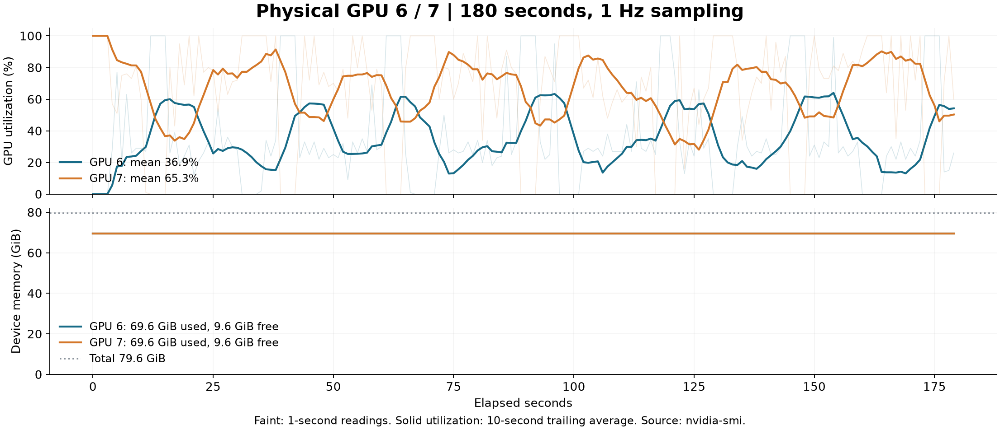
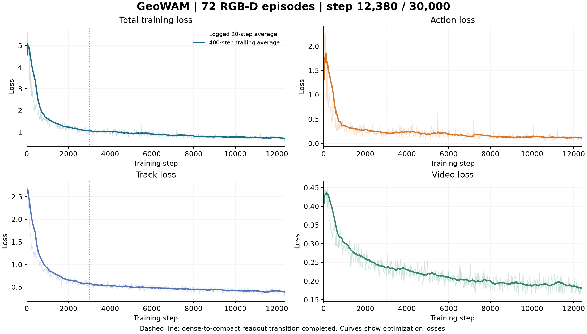
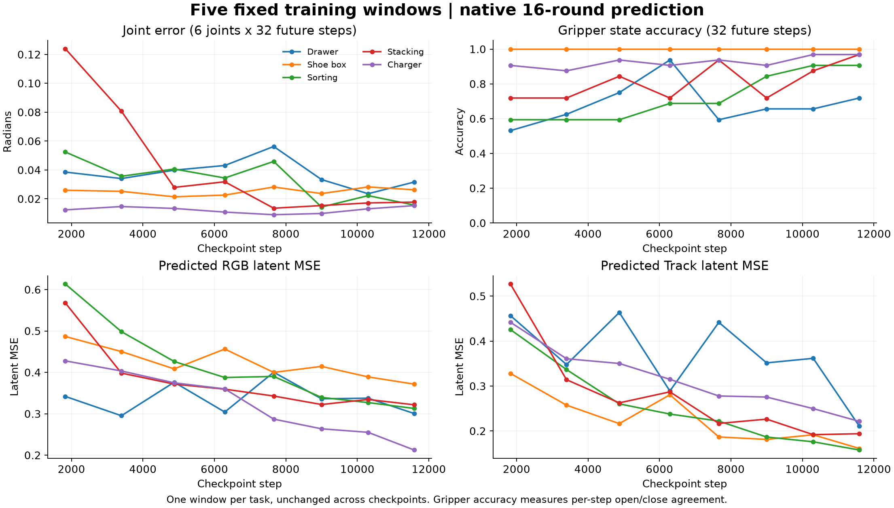

# 数据体积与训练性能（2026-10-10）

本次按服务器实际文件、原始训练日志与 GPU 连续采样整理。用户确认当前两卡并行满意，继续沿用正式配置。本文统计到 12:55（北京时间），曲线到 step 12,380，计划 30,000 步。

## 1. 为什么处理包约 1.30 GB

| 内容 | 实测体积（十进制 GB） | 含义 |
|---|---:|---|
| 全部 87 条原始数据 Release tar | 16.107 | 原始 PNG 图像、深度、机器人状态／动作与记录文件 |
| 其中入选的 72 条原始文件 | 13.158 | 本轮实际训练示范，包含 52,476 个 PNG，图像占 13.141 GB |
| 当前 2,405 个训练窗口 .pt | 1.444 | 已编码的视觉特征、动作、当前条件与辅助标签 |
| 训练窗口＋共享文件 tar.gz | 1.081 | 五任务训练包与一个共享包 |
| 最终几何／QA tar.gz | 0.221 | 最终掩码、UVD、有效区域与检查预览 |
| 已发布处理包合计 | 1.302 | 上述两类处理结果 |

体积变化主要来自输入处理：

1. **筛选记录**：87 条中，桌布／彩色光照 OOD 与缺深度数据按既定规则排除，72 条进入训练。
2. **视觉抽帧与缩放**：原始 10 Hz 视觉每隔 4 帧取一帧；每窗口 9 帧，对应 3.2 秒。两路 RGB 各缩到 320×192，上下拼成 320×384。Track 在主视角 320×240 上处理，再补到 320×256。动作仍保存未来 32 步，保持 10 Hz。
3. **VAE 编码**：将视频和 Track 转成低分辨率 latent，即模型直接处理的数值特征。每窗口 RGB latent 为 48×3×24×20，BF16 下 138,240 字节；Track 为 48×3×16×20，92,160 字节。VAE 属于有损表示，细节保真程度由重建 QA 检查。
4. **最终文件压缩**：训练 .pt 合计 1.444 GB，连同共享文件打包约 1.081 GB；离散 mask、背景零值和重复文本特征有较高压缩率。

原始数据继续保存在原日期 Release，处理数据作为单独版本发布。当前清单只引用修复完成后的窗口；历史缓存、调试废版、模型权重和训练检查点分别管理。

## 2. 两种处理包分别是什么

### 训练包：模型直接读取的样本

每个 .pt 包含：

- 当前及未来 RGB／Track 的 VAE 特征。
- 当前 RGB、实测深度、前景 mask 的条件特征。
- 未来 32 步关节／夹爪动作、当前机器人状态、有效动作维度。
- 本体／物体角色、有效运动、进度等辅助标签。
- 编码后的任务文本。

共享包包括任务清单、归一化统计、文本缓存、数据与处理元信息。“共享文件”中的参数主要是这些统计和配置；预训练模型权重位于独立的 models 目录，训练检查点位于 runs 目录。

**用途：恢复后直接训练当前模型。** 当前包已从云端完整恢复并核对 2,405 个窗口及张量接口。详见 [云端交付](16_云端交付.md)。

### 几何／QA 包：特征编码之前的最终标签与检查材料

- `masks_full.npz`：关键帧的分割结果和本体／物体角色。
- `geometry.npz`：最终 UVD 位移、有效区域及相关几何标签。
- 检查预览：mask 叠加、光流／UVD、VAE 重建等，便于逐阶段检查。
- 几何配置及处理元信息在共享包中一同恢复。

**用途：检查 SAM 是否分对目标、UVD 是否对应正确运动，以及重新编码标签。** 对应数据流是“原始 RGB-D → mask／光流 → 最终 UVD → latent 训练缓存”。服务器还保留首／中／末选定帧对的原始双向光流调试文件；Release 中保存最终几何结果与预览。重跑完整 SAM／RAFT 时读取原始 Release。

## 3. 两卡当前运行情况

连续采样时间：12:49:26–12:52:26（北京时间），每秒一次，每卡 180 个读数。

| 物理 GPU | 总显存 | 使用 | 实际空闲 | GPU 平均利用率 | 读数范围 |
|---|---:|---:|---:|---:|---:|
| 6 | 79.65 GiB | 69.61 GiB | 9.57 GiB | 36.9% | 0–100% |
| 7 | 79.65 GiB | 69.60 GiB | 9.58 GiB | 65.3% | 0–100% |

显存表采用 nvidia-smi 的 used／free 原始字段，设备保留内存也占总量。1 GiB = 2^30 字节；训练日志里的 `gpu_mem_gb` 使用十进制 GB，且统计 PyTorch allocated 峰值，两种口径分别记录。

GPU utilization 表示采样期间有 GPU 内核运行的时间比例。两卡有明显周期性波动，反映计算与同步节奏；更细的计算／通信占比可在后续 profiler 中定位。

最近 1,000 步的日志均值：

| 时间项 | 秒／步 |
|---|---:|
| 总步时 | 2.960 |
| forward＋backward | 2.614 |
| optimizer | 0.209 |
| 数据等待 | 0.000590 |
| 在线编码 | 小于 0.000001 |

相邻日志跨越保存／预测时也计入总步时；正常计算阶段约 2.8–2.9 秒／步。按日志总步时折算，全局约 1.35 个窗口／秒。数据预处理、VAE 和文本编码已缓存，当前数据等待占比很小。

## 4. 并行方式与 batch 的依据

| 参数 | 当前设置 | 作用 |
|---|---|---|
| 两卡协作 | FSDP2，按 Transformer block 分片 | 两卡分担参数、梯度和优化器状态；按层收集计算所需权重 |
| 数值精度 | BF16 计算／归约 | 降低计算与通信开销 |
| 每卡 batch | 2 | 每张卡处理两个窗口 |
| 全局 batch | 4，梯度累积 1 | 两卡各两个窗口，每轮更新一次 |
| 激活检查点 | 开启 | 保存较少中间激活，反向时重新计算 |
| forward 后权重 | `reshard_after_forward=False` | 保留已收集权重，减少 backward 再次收集的通信 |
| 数据进程 | 每卡 4 个 worker | 提前读取本地缓存 |

这是分片数据并行，两卡分别处理数据并共同更新同一模型。每卡都会执行 Video／Track／Action 专家。模型约 67.5 亿参数，完整微调还需梯度与优化器状态，因此 batch 数字较小也会占用大部分显存。

昨晚短测的真实情况：batch 1 跑 3 步，batch 2 跑 2 步并保存、恢复到第 3 步；两者清单和 worker 数也有差异。短测用于验证加载、训练、检查点及五任务推理。正式采用 batch 2 后已持续运行至本报告的 12,380 步。该选择定位为稳定启动配置，吞吐优化需采用同清单、同阶段、充分预热的比较。

`reshard_after_forward=False` 已经使用更多显存来减少通信；这是 [PyTorch 2.11 FSDP 文档](https://docs.pytorch.org/docs/2.11/distributed.fsdp.fully_shard.html) 明确描述的取舍。激活检查点的重计算／显存关系见 [PyTorch 官方说明](https://pytorch.org/blog/activation-checkpointing-techniques/)。

### 留待后续的提速方向

- **增加每卡 batch 到 3／4**：比较每秒窗口数、峰值显存和稳定性。
- **部分层保留激活**：利用剩余显存减少反向重计算；当前配置只有全局开关，选择性开启需要实现对应设置后短测。
- 使用相同检查点与数据，充分预热后测 20–50 步；先只改变一个变量。
- 增大 batch 同时改变全局样本量。例如 30,000 步 × 4 = 120,000 次窗口采样；全局 batch 6 时，相同采样量对应 20,000 步。比较时同步记录更新次数与样本预算。

**用户已确认当前并行满意，本轮沿用现有配置持续训练。**

## 5. Loss 和拟合结果

浅线为日志中的 20 步平均，深线为 400 步滑动平均。第 3,000 步完成 dense-to-compact 读取过渡。最近曲线仍在缓慢下降，loss 和梯度数值均为有限值。

| 训练区间 | Total | Action | Track | Video |
|---|---:|---:|---:|---:|
| 4,000–5,000 步 | 0.961 | 0.212 | 0.508 | 0.221 |
| 8,000–9,000 步 | 0.784 | 0.132 | 0.440 | 0.194 |
| 最近 1,000 步 | 0.721 | 0.117 | 0.404 | 0.185 |

固定五个训练窗口使用原生 16 轮采样，按六关节的完整 32 步与夹爪 32 步分别计算误差。step 1,828 → 11,589：

- 平均关节误差：0.0507 → 0.0214 rad，约 2.90° → 1.22°。
- 夹爪开闭逐步一致率：75.0% → 91.25%。
- RGB latent MSE：0.488 → 0.304。
- Track latent MSE：0.436 → 0.189。

这些指标展示固定训练片段的拟合进展。抽屉的夹爪一致率为 71.9%，较其他四个固定窗口低，后续重点查看其抓取／关闭阶段的完整动作曲线。各任务表现存在波动，继续结合训练 loss 和预测序列判断。

## 6. 本次产物

- 本文和三张图；原始采样与统计 JSON 同目录保留。
- 分析脚本：[analyze.py](evidence/performance_20261010/analyze.py)，运行在 CPU；工作目录 `runs/performance_review_20261010/`。
- 更新 [参数与选择依据](training/01_参数与选择依据.md)，明确短测范围与显存单位。
- 正式模型、训练配置与数据版本沿用现有设置。
- Overleaf：新增 0、修改 0、删除 0。
