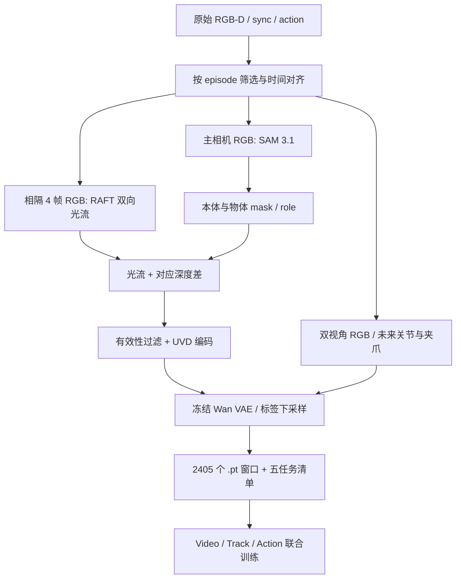

# 数据处理

按顺序阅读：

1. [原始数据与筛选](01_原始数据与筛选.md)：87 条怎样选成 72 条。
2. [时间、动作与窗口](02_时间动作与窗口.md)：10 Hz 数据怎样组成 32 步样本。
3. [SAM 掩码](03_SAM掩码.md)：提示、跟踪、角色与修复。
4. [RAFT 与 Track-UVD](04_RAFT与UVD.md)：二维光流怎样结合深度。
5. [编码缓存与验收](05_编码缓存与验收.md)：模型实际吃什么，怎样检查。

本文档中的数据路径均相对工作区 `/data/chenyiteng/projects/geowam-real`。

训练缓存足够供现有模型加载；最终 mask／UVD 和 QA 包用于审阅、重编码及定位问题。原始数据包用于重跑 SAM／RAFT。
